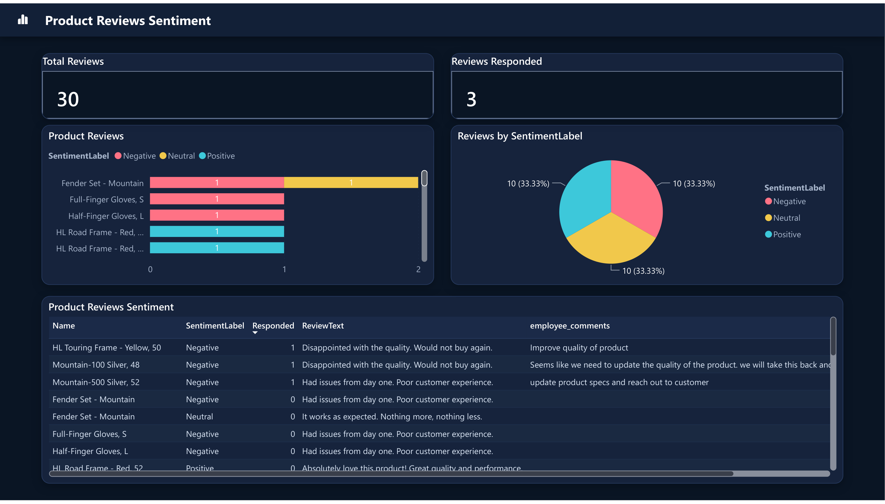
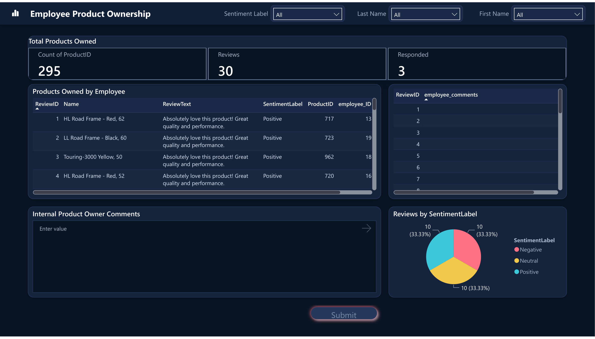

# Translytical Task Flow — Product Review Response Demo

A complete, working example of a **translytical task flow** in Microsoft Fabric: end users read
customer product reviews in a Power BI report, type a response, click **Submit**, and the response is
written straight back to the source SQL database — no refresh, no export, no separate app.

Everything needed to rebuild it is in this repo: SQL schema and seed data, the user data function,
the semantic model (TMDL), and the Power BI report (PBIR).





---

## How it works

```
┌─────────────────────────┐   1. read (DirectQuery)   ┌──────────────────────────┐
│  Power BI report        │ <──────────────────────── │  Fabric SQL database     │
│  - review tables        │                           │  dbo.product_reviews     │
│  - comment input slicer │   3. write (UPDATE)       │  dbo.product_review_     │
│  - "Submit" button      │ ──────────┐               │       feedback  <- target│
└──────────┬──────────────┘           │               └──────────────────────────┘
           │ 2. invoke with           │                            ▲
           │    productid / ReviewID  │                            │
           │    EmployeeID / comment  ▼                            │
           │            ┌─────────────────────────────┐            │
           └──────────► │  Fabric User Data Function  │ ───────────┘
                        │  write_emp_info_on_product_ │
                        │  Review  (Python)           │
                        └─────────────────────────────┘
```

The round trip works because the semantic model is **DirectQuery** over the same SQL database the
function writes to. The moment the function commits, the next visual query reads the new value.

## What's in here

| Path | Contents |
| --- | --- |
| `sql/01-create-tables.sql` | Schema for the four demo tables |
| `sql/02-seed-data.sql` | 20 employees, 30 reviews, 30 feedback rows, 295 ownership rows |
| `user-data-function/` | The Python writeback function and its item definition |
| `semantic-model/` | Semantic model in TMDL format (8 tables, DirectQuery) |
| `report/` | Power BI report in PBIR format (2 pages, dark theme, data function button) |
| `scripts/Set-Environment.ps1` | Stamps your own workspace/database IDs into the definitions |

## Prerequisites

- A Fabric workspace on a **Fabric capacity** (F or trial SKU)
- Permission to create a SQL database, user data function, semantic model and report
- The **AdventureWorksLT** sample data — the demo joins to `SalesLT.Product`, `SalesLT.ProductModel`,
  `SalesLT.ProductDescription` and `SalesLT.ProductModelProductDescription`

---

## Setup

### 1. Create the SQL database

Create a **SQL database** in your workspace and choose the option to load the **AdventureWorksLT**
sample data. Then run, in order:

```
sql/01-create-tables.sql
sql/02-seed-data.sql
```

`dbo.product_review_feedback` is the writeback target. It is seeded with one row per review and
`employee_comments` deliberately left `NULL` — that's what the report fills in.

### 2. Create the user data function

Create a **User data function** item, add a connection to the SQL database from step 1, and set its
**alias to `SQLDemo2026`** (or change the alias in both `definition.json` and the `@udf.connection`
decorator). Paste in `user-data-function/function_app.py` and publish.

> `function_app.original.py` is the simpler first-draft version, kept for comparison. The main file
> adds input validation, a rollback path and — most importantly — a `cursor.rowcount` check. See
> [Gotchas](#gotchas-worth-knowing).

### 3. Stamp in your identifiers

The definitions ship with placeholders rather than hard-coded IDs. Collect your workspace ID, SQL
database name/ID, and the user data function ID, then:

```powershell
cd scripts
./Set-Environment.ps1 -WhatIf `
    -WorkspaceName      'My Workspace' `
    -WorkspaceId        '<your workspace guid>' `
    -SqlServerFqdn      '<your server>.database.fabric.microsoft.com' `
    -SqlDatabaseName    '<db name>-<db guid>' `
    -SqlDatabaseId      '<db guid>' `
    -UserDataFunctionId '<udf guid>'
```

Drop `-WhatIf` to apply. The SQL server FQDN and database name are on the SQL database's
**Settings → Connection strings** page.

| Placeholder | Where to find it |
| --- | --- |
| `<WORKSPACE_ID>` | Workspace URL: `/groups/{id}` |
| `<WORKSPACE_NAME>` | Workspace display name |
| `<SQL_SERVER_FQDN>` | SQL database → Settings → Connection strings |
| `<SQL_DATABASE_NAME>` | Same page — includes the `-{guid}` suffix |
| `<SQL_DATABASE_ID>` | SQL database item URL |
| `<USER_DATA_FUNCTION_ID>` | User data function item URL |

### 4. Deploy the semantic model and report

Publish `semantic-model/` and `report/` to your workspace. Any of these work:

- **Fabric Git integration** — point a workspace at your fork and sync
- **`fabric-cli`** — `fab import` the folders
- **Fabric REST API** — `POST /v1/workspaces/{id}/items/{id}/updateDefinition`

Then set credentials on the semantic model (**Settings → Data source credentials**), and confirm the
storage mode is still **DirectQuery**.

### 5. Re-point the button

Data function buttons store an explicit reference to a workspace + function and **do not rebind
automatically across workspaces**. Open the report, select the **Submit** button, and under
**Format button → Action** re-pick your workspace and function. Then confirm the four parameters:

| Function parameter | Bound to |
| --- | --- |
| `productid` | `[Selected ProductID]` measure |
| `ReviewID` | `[Selected ReviewID]` measure |
| `EmployeeID` | `[Selected EmployeeID]` measure |
| `employeeComments` | the comment text slicer |

### 6. Try it

On **Employee Product Ownership**: select a review row, type a response, click **Submit**. The
comment appears in the report immediately, and `SELECT * FROM dbo.product_review_feedback` shows the
new text with a fresh `updated_date`.

---

## The semantic model

Eight DirectQuery tables in a star schema:

```
Products ──1:*── Product Reviews ──1:*── Product Review Feedback   (writeback target)
   │                                            │
   │                                            └──*:1── Employees
   ├──1:*── Assigned Products ──*:1── Employees
   └──*:1── Product Model ──1:*── Product Model Description ──*:1── Product Description
```

Three measures make the writeback robust. They read the **writeback table itself**, so they resolve
no matter which visual the user selects from:

```dax
Selected ReviewID   = SELECTEDVALUE('Product Review Feedback'[ReviewID])
Selected EmployeeID = SELECTEDVALUE('Product Review Feedback'[employee_ID])
Selected ProductID  = SELECTEDVALUE('Product Review Feedback'[ProductID])
```

## Gotchas worth knowing

Each of these cost real debugging time on the original build.

**1. Bind button parameters to measures, not dimension columns.**
Binding `productid` to `Products[ProductID]` works only while a filter path happens to reach the
`Products` table. Selecting a review does *not* filter a dimension table in a star schema, so the
parameter silently returns blank. `SELECTEDVALUE` measures on the writeback table always resolve.

**2. Always check `cursor.rowcount` before committing.**
The first version of this function returned `"Employee has inserted comments"` unconditionally. When
the bindings broke, the `UPDATE` matched zero rows and users still saw a success message. The
function looked healthy while saving nothing.

**3. Keep the writeback table on the "many" side.**
Modelling `Product Reviews ↔ Product Review Feedback` as **one-to-one** is fragile: a 1:1
relationship requires permanent uniqueness on both sides, and the writeback table is exactly the one
that grows. Use many-to-one (feedback as the many side) with bi-directional cross-filtering.

**4. DirectQuery is what makes the round trip instant.**
Switch the model to Import and the write still reaches SQL, but the report shows stale data until a
refresh — which usually reads as "the writeback is broken".

**5. Custom report themes are all-or-nothing on naming.**
In PBIR, a custom theme only loads when `themeCollection.customTheme.name`, the resource item `name`
and its `path` all match exactly, **including the `.json` extension**. A partial match fails silently
and falls back to the base theme.

**6. Per-visual formatting isn't schema-validated on upload.**
`report.json` is validated, but visual formatting objects are not. Setting a property that doesn't
exist on that visual type is accepted by the API and then puts the visual into an error state at
render time. Only set properties you know exist for that visual.

## Reference

- [Understand translytical task flows](https://learn.microsoft.com/power-bi/create-reports/translytical-task-flow-overview)
- [Create a data function button in Power BI](https://learn.microsoft.com/power-bi/create-reports/translytical-task-flow-button)
- [Fabric user data functions](https://learn.microsoft.com/fabric/data-engineering/user-data-functions/user-data-functions-overview)
- [SQL database as the source engine for translytical apps](https://learn.microsoft.com/fabric/database/sql/use-case-translytical-applications)

## Notes

Artifact definitions were exported from a working Fabric workspace and sanitised — all workspace,
database and item identifiers are placeholders. No credentials or connection secrets are stored in
this repo; the semantic model authenticates through Fabric-managed credentials and the function
connects through its Fabric connection alias.
